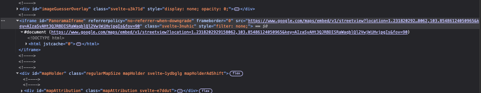
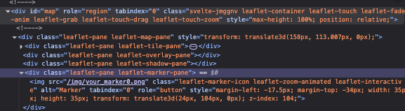

## Simple command sheet 

Outlines JS for various commands for selenium scripts 

Places marker randomly
```python
map_el = wait.until(EC.presence_of_element_located((By.ID, "map")))

while True 
    ActionChains(driver).move_to_element_with_offset(map_el, 100,50).click().perform()
```

Grabs map size 

```python
    map_size = map_el.size
    map_width = map_size['width']
    map_height = map_size['height']
```


## Screen Shots 
Ground truth coordinate grab


Map Panel



## Key points 
1. Image extraction: Extract and clean image of all peripheral elements 

2. Marker plotting: Plot marker onto map 